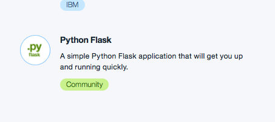
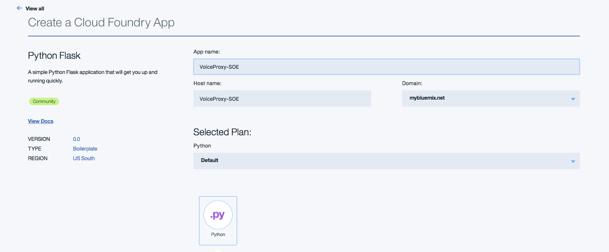
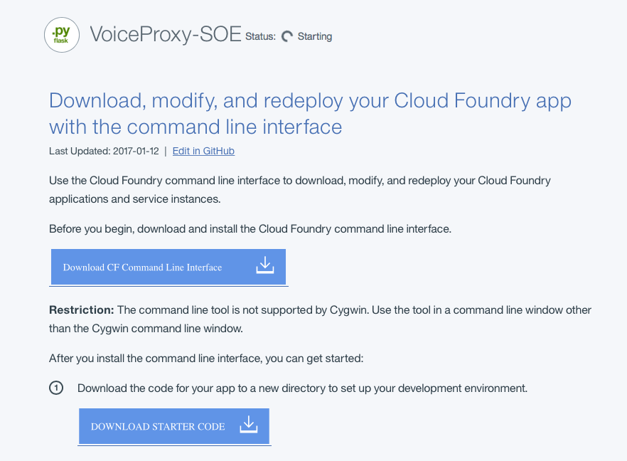

# Python based Service Orchestration Engine sample (VoiceProxy)
Python based Voice Proxy for integrating Voice Gateway for Watson, Watson Conversation Service and a clients backend APIs.

## Purpose
The purpose of this project is to show how a developer can integrate the Watson Conversation service with the voice gateway
in a more realistic way. A way that is more common in a clients environment either for a proof of concept or a production
implementation. 

## Some Background
By default the IBM Voice Gateway (VGW) can communicate with the Watson Conversation Service (WCS) by using the REST
services provided by the WCS. The service uses a single REST API for all conversation interactions. VGW exploits this API by
creating the appropriate JSON payload when transcribing the spoken words from the caller and invoking the API. The challenge with
VGW communicating directly with WCS is that there is no way to personalize the conversation interactions. WCS only maintains static
information based on any one particular question being asked. If there is a desire to have dynamic responses, there needs to be
a way for the runtime to make API calls to other services to lookup the additional information and provide it as part the response
to either WCS or to VGW. This is where the voice proxy idea comes in. 

Since WCS only has one API for the conversation, it is very easy to impersonate (proxy) that API. Also since the JSON format
used in WCS is well documented, it is easy to ensure that the proxy can make updates and communicate with WCS on behalf of any
invoker. VGW being the most interesting.

## Goal
The goal of this sample is for the user to get an understanding of how to create a Proxy that communicates with both VGW and WCS. Additionally for the user to get an appreciation for some of the common aspects that exists (patterns) when the proxy is being used. These patterns
are based on several client implementations. In essence lessons learned. You can leverage this code or you can see the high level flow and create your own if python isn't your thing. Some might prefer Node.JS, Java or even Node-Red.

## Sample Watson Conversation Workspace
We have provided a sample Conversation Workspace as a part of the tutorial. The JSON is in the workspace folder. The sample 
workspace is a typical call center like scenario for banking. 

We have two Entities define as part of the tutorial.

1. Loans (Auto loan, Mortgage and Student Loan)
2. Accounts (Checking, Savings and Money Market)

We have defined three intents. When you open the workspace you can see what they are. But at a high level the
following intents are available:

1. Information: General information on the loans or accounts
2. Balance: Check the balance of an account or a loan
3. Payment: Make a payment on a loan from one of the accounts


## Getting Started
Getting started is very simple. Once the code has be cloned, you can deploy the code locally or on IBM's BlueMix. 
Instructions for both approaches are provided below.


### Pre-requisites
The base assumption is you are using the IBM Voice Gateway and want to add dynamic responses based on the dialog
from Watson Conversation Service. Also, we will assume you already have the IBM Voice Gateway installed and are ready to connect
it to a WCS instance. There are several pieces of information needed for this tutorial.

1. Conversation Workspace ID (You get this from your BlueMix Dashboard for the Conversation Service)
2. Userid to connect to the Conversation Service (You get this from your BlueMix Dashboard for the Conversation Service)
3. Password to connect to the Conversation Service (You get this from your BlueMix Dashboard for the Conversation Service)
4. URL of your VoiceProxy application (More on this in a few minutes)
5. Python version 2.7.12 if running standalone
6. Python Flask application if running in BlueMix
7. CloudantDB for Web logging (_optional feature_)


### Local Deployment
Below are the steps to get started with the sample application for local deployment
Once you have checked the code out you need to make a couple of updates

1. You need to install the following python package.  
  You can cut and paste each item below on a command line   
  `pip install requests`   
  `pip install flask`   
  `pip install xmltodict`   
  `pip install couchdbkit`   

   The above only take a few minutes
   
2. Create an instance of Watson Conversation Service. Once the workspace has been created you need to 
import a new workspace. In the workspace folder in the voiceProxy project, you will see a file voiceProxy-demo.json.
Import this file into your workspace. This will create a new Conversation called VoiceProxy-Demo. This is the convesation
you will be connecting to from the VoiceProxy Server.   

	   
	
	Create your new conversation service. 
   
   
	
	Now we need to get access to the credentials for later use. Click on view credentials
	
	
	
	Next we need to copy the workspace_id for use later
	
	
	
   You are going to use the workspace ID above in the next step, along with the userid and password from the credentials page.   
   

3. Export the following environment variables
  - CONVERSATION_WORKSPACE_ID=**workspaceid**
  - CONVERSATION_VERSION=**2016-07-11**
  - CONVERSATION_USERNAME=**username**
  - CONVERSATION_PASSWORD=**password**
  
4. Now you need to change the docker-compose.yml file from the IBM Voice Gateway. Since the default with the Voice
Gateway is to talk directly to the Conversation Service, you need to change the parameter WATSON_CONVERSATION_URL to point
to the voiceProxyServer IP address. You need to change it to the IP of where the voiceProxyServer is running. In addition you
need to specify the port the server is listening on. The default is 5000. Example is below.   
   - WATSON_CONVERSATION_URL=http://10.2.2.31:5000   
   
   In this example the machines IP address is 10.2.2.31 and the port the VoiceProxyServer is listening on is 5000

5. You can now start the server by typing "python voiceProxyServer.py"
You should see something like the following
2017-03-17 05:01:52,372 - INFO -  * Running on http://0.0.0.0:5000/ (Press CTRL+C to quit)


We will supply a link to another project where you can get a viewer for the log entries stored in cloudantDB.  

### BlueMix Deployment
If you want to deploy the application to BlueMix the steps are very straight forward.

1. Create a new Python Flask application on BlueMix. Keep track of you application name, you will need it later.

	
	
	
	
2. Download the starter code for you newly created application and copy it into a temporary directory

	
	

3. Copy the manifest.yml from the temporary directory into the directory that has the voiceProxyServer source code.


4. Create an instance of Watson Conversation Service. Once the workspace has been created you need to 
import a new workspace. In the workspace folder in the voiceProxy project, you will see a file voiceProxy-demo.json.
Import this file into your workspace. This will create a new Conversation called VoiceProxy-Demo. This is the convesation
you will be connecting to from the VoiceProxy Server. 

	
	
	Create your new conversation service. 
	
	
	
	Now we need to get access to the credentials for later use. Click on view credentials
	
	
	
	Next we need to copy the workspace_id for use later
	
	
	

5. On BlueMix, add the following environment variables to the application. These can be added by clicking on the **Runtime** menu item on the left. 
Then in the center of the screen there is an option for **Environment Variables**. 
Click on that and then add a **User Defined** values by clickin on the **Add** button.   
Your screen should look like below:   
   
make sure you use the appropriate values from your newly created WCS conversation.   
Click **Save** when completed.   
6. Login to BlueMix from the command line, from within the voiceProxyServer directory
`cf login -a na.api.bluemix.net`   
Once you are logged on to Bluemix, issue the following command to push the voiceProxyServer to BlueMix 
`cf push YourApplication Name From Step 1`
BlueMix will use the configuration defined and add all the appropriate dependencies. 
Sometimes, the application will not start the first time. This seems to be a bug in Bluemix. I recommend
issuing the push command again. It seems to work the second time.

7. Now you need to change the docker-compose.yml file from the IBM Voice Gateway. Since the default with the Voice
Gateway is to talk directly to the Conversation Service, you need to change the following parameter:   

   - WATSON_CONVERSATION_URL
   to the voiceProxyServer IP address. You need to change it to the IP or the hostname of where the voiceProxyServer is running. In addition you 
   need to specify the port the server is listening on, if you change from the default of 80, defined by Bluemix.   

   
   In this example we are using the route defined from your BlueMix application you created in step 1. Because bluemix handels the ports for you, you don't need to make any other port changes.   
   - WATSON_CONVERSATION_URL=https://pythonbluemixapplication 

   You can now restart the Voice Gateway Docker containers by issuing the following command:   
   `docker-compose up`  

## Voice Script
In an effort to help with using the demo it would be beneficial to know what questions to ask WCS. Below are the sample
questions. Remember, there is an API that keeps track of the balances, so if you withdraw too much money you will get errors.

1. I would like to pay my mortgage
2. My name is Brian
3. Yes it is
4. Baseball
5. I want to use my checking account
6. I wan to pay two hundred dollars
7. Thank you
8. What is the balance of my checking account
9. Thank you.
10. Good-bye


### WebLogging Tool

If you want to use the WebLogger to keep track of the conversation flows between the IBM Voice Gateway and WCS
you need to provision a cloudantDB instance. By default the WebLogger is turned off. But you might want to enable it
for debugging purposes. You can install cloudantDB  on BlueMix for free. If you want to use the WebLogger you need to
do the following:
  - export CLOUDANT_URL = someurl:  
  The URL is on the "Services Credentials" tab in your cloudant dashboad on BlueMix. Click the "View Credentials" button to see the credentials. URL should be on the bottom.
  - export WEB_LOGGING = True:  
  Update the voiceProxySettings.py and change WEB_LOGGING to True or you can export WEB_LOGGING=True as an environment variable  
  - update your CloudantDB with new view to quickly find the log entries
    - Create new Design Document call it "logEntry"
    - Edit the document and paste the following in the editor under _id and _rev lines 

```
"views": {
"comments": {
  "map": "function (doc) {\n  if(doc.comment){\n   emit(doc.comment, [doc.sessionID,doc.conversationid]);\n  }\n}"
},
"sessionID": {
  "map": "function (doc) {\n  if(doc.sessionID){\n    emit(doc.sessionID, [doc.sessionID,doc.application]);\n  }\n}"
},
"application": {
  "map": "function (doc) {\n  if(doc.application){\n    emit(doc.application, 1);\n  }\n}"
},
"uniqueSessions": {
  "map": "function (doc) {\n  emit(doc.sessionID, [doc.sessionID,doc.application]);\n}",
  "reduce": "function (keys, values, rereduce) {\n  return(keys,null)\n}"
}
},
"language": "javascript",
"indexes": {
"fullIndex": {
  "analyzer": "standard",
  "index": "function (doc) {\n  if(doc.sessionID){\n    index(\"sessionID\", doc.sessionID,{\"store\": true});\n  }\n  if(doc.conversationid){\n    index(\"conversationid\", doc.conversationid,{\"store\": true});\n  }\n  if(doc.logtime){\n    index(\"logtime\", doc.logtime,{\"store\": true});\n    }\n  if(doc.component){\n    index(\"component\",doc.component,{\"store\": true});\n  }\n  if(doc.comment){\n    index(\"comment\", doc.comment,{\"store\": true});\n  }\n  if(doc.msg_input_text){\n    index(\"msgInputText\",doc.msg_input_text,{\"store\": true});\n  }\n  if(doc.msg_output_text){\n    index(\"msgOutputText\",doc.msg_output_text,{\"store\": true});\n  }\n}"
},
"logTime": {
  "analyzer": "standard",
  "index": "function (doc) {\n  if(doc.logtime){\n    index(\"logtime\", doc.logtime);\n  }\n}"
}
}
```
### Testing 